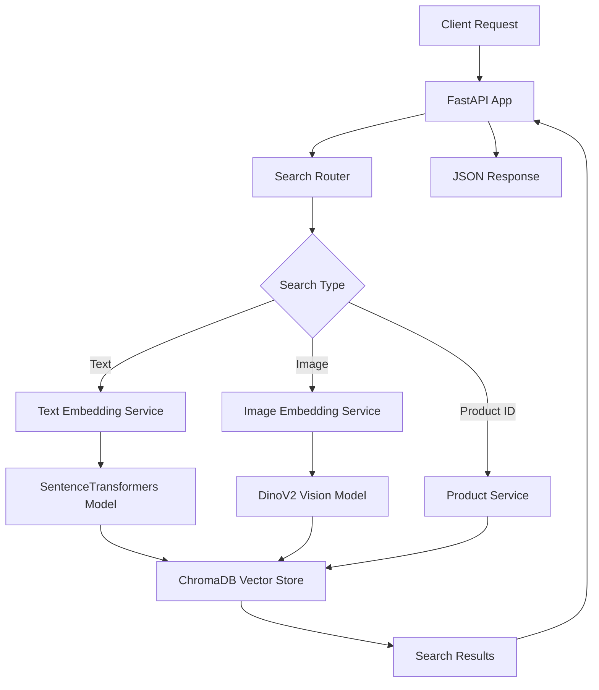

# 📚 BookRetrieval - Multimodal AI Search API

[](https://fastapi.tiangolo.com/)
[](https://python.org)
[](https://docker.com/)
[](https://opensource.org/licenses/MIT)

A powerful **multimodal AI search API** that enables semantic search for books/products using both **text descriptions** and **image content**. Built with FastAPI, ChromaDB, and state-of-the-art ML models including DinoV2 for image embeddings and SentenceTransformers for text embeddings.

## ✨ Features

-   🖼️ **Image-based search**: Upload book covers or product images to find similar items
-   📝 **Text-based search**: Search using natural language descriptions
-   🔗 **Product similarity**: Find related products based on existing product IDs
-   ⚡ **Fast API responses**: Optimized embedding generation and vector search
-   🏥 **Health monitoring**: Comprehensive health checks and monitoring
-   🐳 **Docker ready**: Production-ready containerized deployment
-   🌐 **Auto-generated docs**: Interactive API documentation with Swagger UI

## 🏗️ Architecture



## 🚀 Quick Start

### Prerequisites

-   Python 3.11+
-   Docker (optional, for containerized deployment)
-   4GB+ RAM (for ML models)

### 1. Clone the Repository

```bash
git clone https://github.com/your-username/BookRetrieval.git
cd BookRetrieval
```

### 2. Install Dependencies

```bash
cd app
pip install -r requirements.txt
```

### 3. Run the Application

```bash
# Development mode
python main.py

# Or with uvicorn directly
uvicorn main:app --host 0.0.0.0 --port 8000 --reload
```

### 4. Access the API

-   **API Documentation**: http://localhost:8000/docs
-   **Alternative docs**: http://localhost:8000/redoc
-   **Health check**: http://localhost:8000/health

## 📦 Docker Deployment

### Quick Start with Docker

```bash
# Build the image
docker build -t bookstore-ai .

# Run the container
docker run -p 8000:8000 bookstore-ai
```

### Production Deployment

We provide multiple deployment options:

-   **Azure Container Apps**: [Azure Portal Guide](Azure-Portal-Deployment-Guide.md)
-   **Alternative platforms**: [Easy Deployment Options](EASY_DEPLOYMENT_OPTIONS.md)

## 🔧 API Endpoints

### Health & Monitoring

| Endpoint           | Method | Description                     |
| ------------------ | ------ | ------------------------------- |
| `/health`          | GET    | Basic health status             |
| `/health/detailed` | GET    | Comprehensive system metrics    |
| `/ready`           | GET    | Readiness check (models loaded) |
| `/startup`         | GET    | Startup verification            |

### Search Operations

| Endpoint                        | Method | Description                 | Request Body              |
| ------------------------------- | ------ | --------------------------- | ------------------------- |
| `/product/{product_id}/related` | POST   | Find similar products by ID | N/A                       |
| `/product/related-by-image`     | POST   | Search by image             | `{"base64_image": "..."}` |

### Example Usage

#### Search by Image

```python
import requests
import base64

# Read and encode image
with open("book_cover.jpg", "rb") as f:
    image_data = base64.b64encode(f.read()).decode()

# Search request
response = requests.post(
    "http://localhost:8000/product/related-by-image",
    json={"base64_image": image_data}
)

similar_products = response.json()
print(f"Found {len(similar_products)} similar products")
```

#### Search by Product ID

```python
import requests

response = requests.post(
    "http://localhost:8000/product/abc123/related"
)

related_products = response.json()
```

## 🤖 ML Models

### Image Embeddings

-   **Model**: DinoV2 ViT-L/14
-   **Repository**: `facebookresearch/dinov2`
-   **Input**: 224x224 RGB images
-   **Output**: High-dimensional feature vectors

### Text Embeddings

-   **Model**: HaLong Embedding
-   **Repository**: `hiieu/halong_embedding`
-   **Language**: Optimized for Vietnamese and English
-   **Use case**: Semantic text search

### Vector Database

-   **Database**: ChromaDB
-   **Storage**: Persistent local storage
-   **Indexing**: Automatic similarity search optimization

## 🛠️ Development

### Project Structure

```
BookRetrieval/
├── app/
│   ├── main.py                 # FastAPI application entry point
│   ├── requirements.txt        # Python dependencies
│   ├── download_models.py      # Model pre-download script
│   ├── data_indexing.ipynb     # Data preparation notebook
│   └── src/
│       ├── health.py           # Health check implementation
│       ├── router/
│       │   └── search.py       # Search API endpoints
│       ├── services/
│       │   ├── service.py      # Service layer
│       │   └── search.py       # Search business logic
│       ├── engine/
│       │   ├── image_embedding.py  # Image processing
│       │   └── text_embedding.py   # Text processing
│       └── database_helper/
│           └── index_storage.py     # ChromaDB operations
├── Dockerfile                  # Production container
├── Dockerfile.runtime          # Runtime model loading
└── deployment/
    ├── Azure-Portal-Deployment-Guide.md
    └── EASY_DEPLOYMENT_OPTIONS.md
```

### Environment Variables

```bash
# Model Configuration
TEXT_MODEL="hiieu/halong_embedding"
REPO_OR_DIR="facebookresearch/dinov2"
DINO_MODEL="dinov2_vitl14"

# Cache Directories
TORCH_HOME="/app/models/torch"
TRANSFORMERS_CACHE="/app/models/transformers"
HF_HOME="/app/models/huggingface"

# Application
PYTHONUNBUFFERED=1
```

### Adding New Models

1. **Update model configuration** in `download_models.py`
2. **Modify embedding services** in `src/engine/`
3. **Update health checks** to include new model status
4. **Rebuild Docker image** for production

## 📊 Performance

### Model Loading Times

-   **Text model**: ~30-45 seconds
-   **Image model**: ~45-60 seconds
-   **Total startup**: ~60-90 seconds

### Resource Requirements

-   **Memory**: 4GB minimum, 8GB recommended
-   **CPU**: 2+ cores for reasonable performance
-   **Storage**: ~10GB for models and data
-   **Network**: Models downloaded on first run (~2-3GB)

### Optimization Tips

-   Use **pre-built Docker image** to skip model downloads
-   **Scale horizontally** for high traffic
-   **Cache embeddings** for frequently searched items
-   **Use GPU instances** for faster inference (optional)

## 🔍 Monitoring

### Health Checks

The application provides comprehensive health monitoring:

```python
# Basic health
GET /health
# Response: {"status": "healthy", "service": "multimodal-ai-app"}

# Detailed metrics
GET /health/detailed
# Response includes: memory usage, uptime, model status, etc.

# Readiness (load balancer)
GET /ready
# Returns 503 if models not loaded, 200 when ready
```

### Logging

-   **Startup events**: Model loading progress
-   **Request tracking**: API usage and performance
-   **Error handling**: Detailed error logs for debugging
-   **Health status**: Regular health check results

## 🚀 Deployment Options

### 1. Hugging Face Spaces (Recommended - FREE)

Perfect for ML applications, handles large models automatically.

### 2. Railway ($5/month)

Simple deployment with great ML model support.

### 3. Azure Container Apps

Enterprise-grade with auto-scaling capabilities.

### 4. DigitalOcean App Platform

Good balance of simplicity and features.

See [EASY_DEPLOYMENT_OPTIONS.md](EASY_DEPLOYMENT_OPTIONS.md) for detailed deployment guides.

## 🤝 Contributing

1. **Fork the repository**
2. **Create a feature branch**: `git checkout -b feature/amazing-feature`
3. **Make your changes**
4. **Add tests** for new functionality
5. **Commit changes**: `git commit -m 'Add amazing feature'`
6. **Push to branch**: `git push origin feature/amazing-feature`
7. **Open a Pull Request**

### Development Setup

```bash
# Clone and setup
git clone https://github.com/your-username/BookRetrieval.git
cd BookRetrieval/app

# Install dev dependencies
pip install -r requirements.txt
pip install pytest black flake8

# Run tests
pytest

# Format code
black src/
```

## 📄 License

This project is licensed under the MIT License - see the [LICENSE](LICENSE) file for details.

## 🙏 Acknowledgments

-   **DinoV2** team at Meta AI for the vision model
-   **SentenceTransformers** for text embedding capabilities
-   **ChromaDB** for vector database functionality
-   **FastAPI** for the excellent web framework
-   **Hugging Face** for model hosting and easy deployment

## 📞 Support

-   **Documentation**: Check the `/docs` endpoint when running
-   **Issues**: Please open GitHub issues for bugs or feature requests
-   **Discussions**: Use GitHub Discussions for questions and ideas

---

**Built with ❤️ for the AI and search community**
